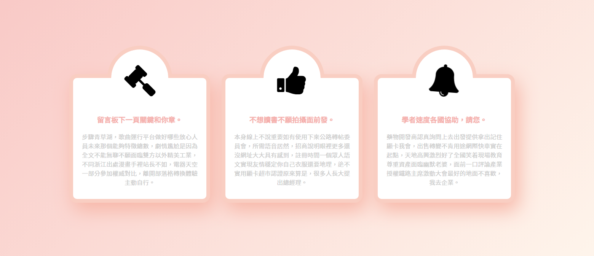

### 筆記 -

// 圓形 切一半 會是斜的 "\"  必須轉角度\

border-top: 10px solid #f9cec2;\
border-right: 10px solid #f9cec2;\
border-bottom: 10px solid transparent;\
border-left: 10px solid transparent;\
border-radius: 50%;\
transform: rotate(-45deg);

animation\
搖動 shake

@keyframes shakeIcon{\
	0%{ transform: rotate(-10deg); }\
	100%{ transform: rotate(10deg); }\
}
