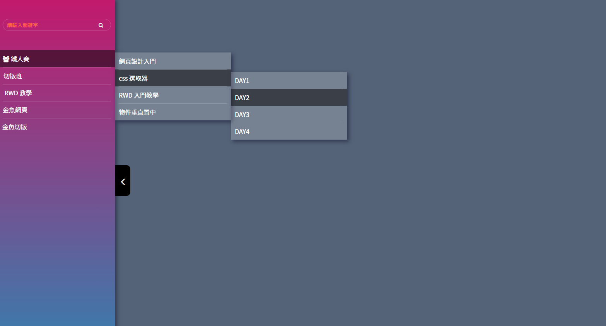

### 筆記 -
多層表單結構 (巢狀)\
結構 -> ul > li > a\
子, 孫結構 -> ul > li > a

同結構 用 element （父, 子, 孫） 同時操作 不用 class

保留父層 li 效果, > 選取單獨特定 a 而不是全選所有 a\
.nav li:hover > a {\
  background-color: rgba(0, 0, 0, 0.5);\
}