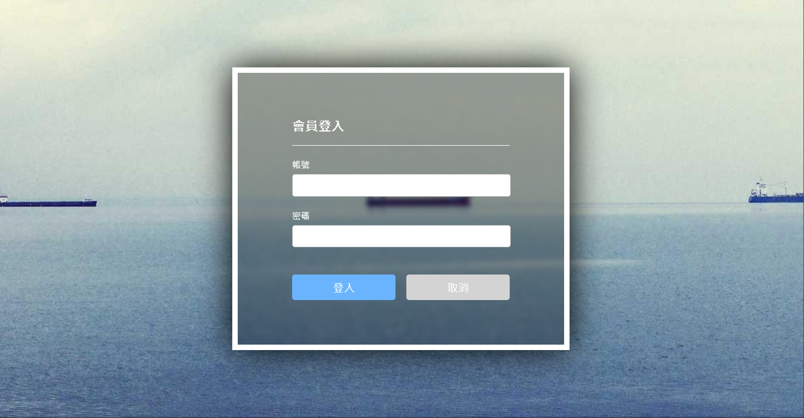

### 筆記 -

<* label for="user_id">帳號 <*/label>\
// id 設置給 label 使用, 點擊 label 後 自動帶入 input 輸入\
<* input type="text" id="user_id" />

 // html, body 預設是由內容撐開（撐起高度）, 一開始不會滿版  要居中的話  必須設定滿版 100%\ 

  html,\
  body {\
    height: 100%;\
  }

backdrop-filter: blur(4px);\
毛玻璃特效

.form .btn-group {\
    兩個 btn 中間會有一個小空隙
  
    這是因為因為元素節點有文本節點，在縮進代碼時會佔據寬度。\
    加上 font-size: 0後，把他消除
  
    inline && inline-block元素間隙\
    元素間留白間距出現的原因就是標籤段之間的空格
  
    /* 解釋：\
    font-size: 0 不是指字體大小是0px
  
    一句話總結作用：\
    消除內聯元素間的間隔（空格）。
  
    問題根因：\
    代碼自動格式化的時候，往往會設置一些適當的縮進、換行，\
    display為inline和inline-block的時候（內聯元素），
    當你代碼換行後，就會在網頁上產生一個空格，導致前端頁面展示變形，\
    避免方法可以不換行，顯然這種方法會極大降低代碼可讀性，\
    所以一般都是將父元素的font-size設為0 \
  */

    font-size: 0;\
    margin-top: 50px;\
  }