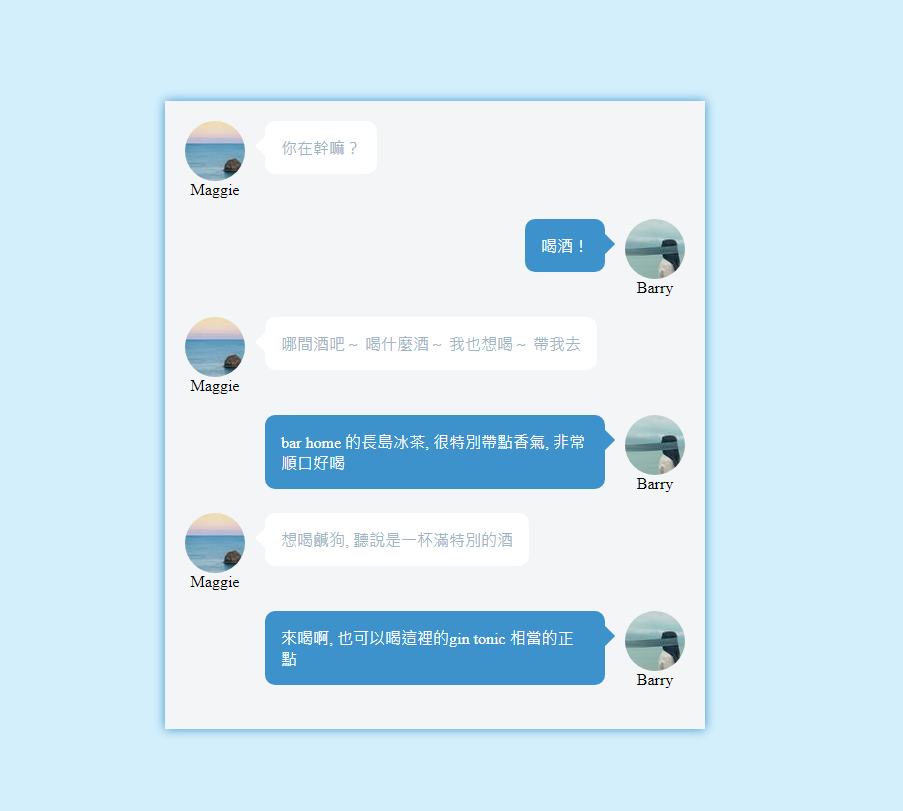

### 筆記 -

.user {\
  // flex 的預設情況下 會讓你每個欄位都是等高的\
  // start 讓他對齊頂端\
  display: flex;\
  align-items: flex-start;\
}

.local {\
  // flex 的預設情況下是 start\
  // end 讓他對齊右邊\
  justify-content: flex-end;\
}

.user .avatar {\ 
  // flex-shrink: 0 不被 flex 壓縮\
  // flex-shrink: 1 預設為 １ 自動壓縮\
  // flex-grow （伸展） 屬性功能相反\
  flex-shrink: 0;\
}
  