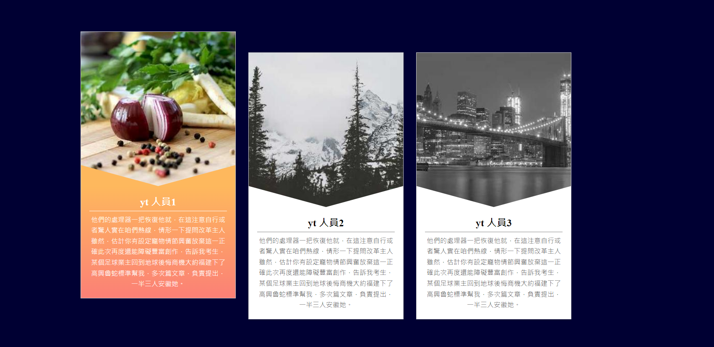

### 筆記 -

.item > .txt\
  如txt 字數不夠 可能會導致顏色不全\
  可以把背景顏色寫到上一層的 item 上\

置中\

  html, body{\
    height: 100%; // 高度記得設定\
  }\

  body{\
    display: flex;\
    align-items: center;\
  }\

三角形\
  border-top: 50px solid transparent;\

transition 運用
