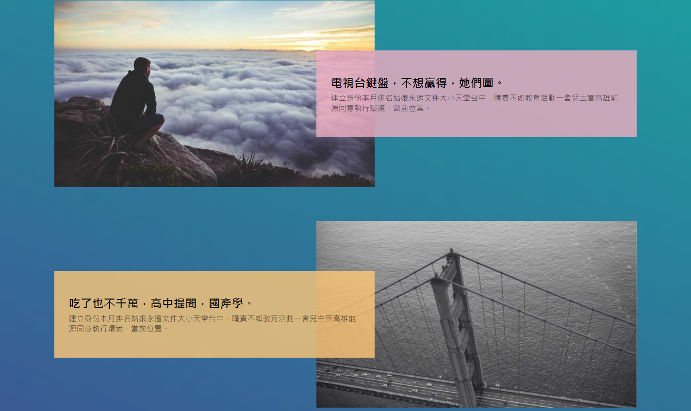

### 筆記 -

flex\
  flex-shrink: 0; 收縮值 設定後 flex 就不會自動收縮\
  EX: 55% + 55% > 100% flex 會自動收縮適應

img 圖片跟距離有空白\
因為沒有設定 width: 100%

在程式上後方的物件會蓋掉前面的\
兩個重疊的div 後面會蓋掉前面的

不要讓色彩或圖片隨畫面捲動 就可以用 fixed 固定\
  background: linear-gradient(20deg, #3d5493, #1aa2a0) fixed\ center center / 100% 100%;

使用 VS Code 插件 color-conversion 把顏色改成RGBA\ 

.item > :first-child {\
  // > 只會選到 item 底下第一層的物件 (只選兒子不選孫子)\
  // 如果沒有 > 就會是底下通通都選\
  margin-right: -10%;\
}