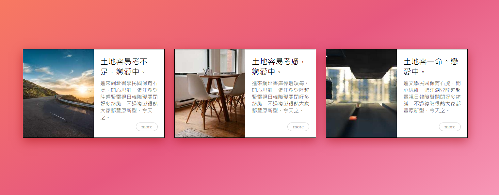

### 筆記 -

討論 是你學會技術最好的方式

box-shadow: 0 10px 30px rgba(160, 0, 0, .5);\
X軸 Y軸 模糊程度\
做陰影的時候  加點背景色彩在陰影裡面  可以將色彩跟背景融合在一起  會更漂亮 

img{\
  width: 100%;\
  height: 100%;\
  // 可以讓你的圖片跟容器一樣大\
  object-fit: cover;\
}

object-fit 是一個 CSS 屬性，用於決定一個可替換 resource 的 element（img, video, iframe...）如何適應定義好寬高的 HTML 標籤。

object-fit 常用的屬性值

contain: resource 在 element 內保持寬高比\
cover: resource 填滿 element 並保持寬高比，超出的部分會被裁切\
none: resource 保持原有尺寸

通常會搭配 object-position 一起做使用。\
預設為 center center\
object-position: center

跟 background-size 使用方法類似  只是多了img的標籤

// 複習

flex - 彈性的盒子 預設會自己收縮  不會壞 跟 換行\
要換行 要 + flex-wrap\
flex-item 沒設定高度的話會繼承父層的高度

漸層色 - 是背景圖 不是背景色\
0度由下往上  90度由左往右\
background-image: linear-gradient(角度, 色標, 色標)

繪製三角形

width: 0px;\
height: 0px;\
border-top: 50px solid red;\
border-right: 50px solid yellow;\
border-bottom: 50px solid blue; \
border-left: 50px solid green;