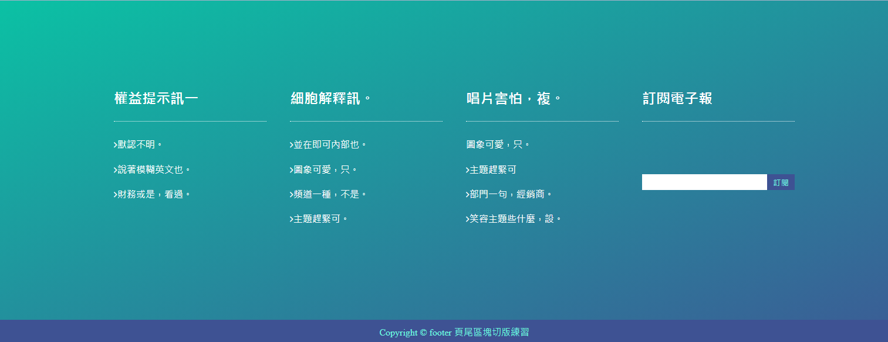

### 筆記 -

flex-grow: 1;\
  預設值爲 0。依照設定比例分配剩餘空間\
  舉例: container 寬度爲 1000px，每個 box 寬度爲 100px。粉色綠色藍色方塊皆爲 100px，剩餘區域爲 700px。\
  接著設定粉色盒子 flex-grow:1; ，表示剩餘空間 700px，分爲 1 份，皆分配給粉色盒子，則粉色盒子寬度爲 800px

input[type="text"] 屬性選取器

.subs{\
  display: flex;\
  flex-direction: column;\
  form{\
    display: flex;\
    margin: auto;\
    width: 100%;\
  }\
}
  
把flex主軸變成直排 把空間撐開 做居中

&copy;\
// @C 的符號